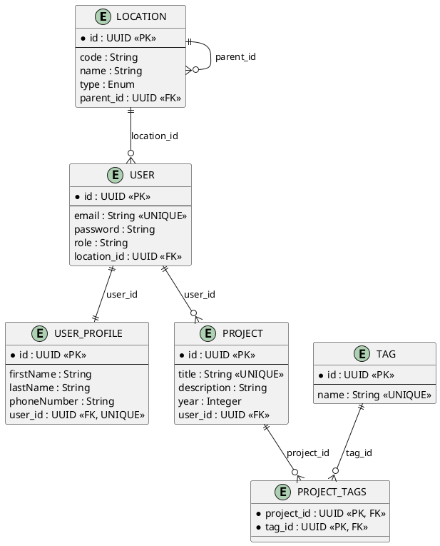

# Visual Entity Relationship Diagram

## PlantUML ERD Diagrams

### How to View:
1. Copy the content from `ERD_Diagram.puml` or `ERD_Simple.puml`
2. Go to http://www.plantuml.com/plantuml/uml/
3. Paste the code and view the diagram

OR

1. Install PlantUML extension in VS Code
2. Open the `.puml` files
3. Press Alt+D to preview

### Files Created:
- `ERD_Diagram.puml` - Detailed diagram with notes and styling
- `ERD_Simple.puml` - Clean, simple diagram

### PlantUML Code (ERD_Simple.puml):

## Relationship Cardinality Legend

- `||--||` : One-to-One (1:1)
- `||--o{` : One-to-Many (1:N)
- `}o--o{` : Many-to-Many (M:N)

## Key Relationships

### 1. LOCATION ↔ LOCATION (Self-Referencing)
**Type**: One-to-Many (Hierarchical)
- A parent location can have multiple child locations
- Example: Kigali Province → [Gasabo District, Kicukiro District, Nyarugenge District]

### 2. LOCATION ↔ USER
**Type**: One-to-Many
- One location can have many users
- Each user belongs to one location

### 3. USER ↔ USER_PROFILE
**Type**: One-to-One
- Each user has exactly one profile
- Bidirectional with cascade delete

### 4. USER ↔ PROJECT
**Type**: One-to-Many
- One user can own multiple projects
- Each project has one owner

### 5. PROJECT ↔ TAG
**Type**: Many-to-Many
- One project can have multiple tags
- One tag can be used by multiple projects
- Implemented via PROJECT_TAGS join table

## Database Schema Summary

**Total Entities**: 6 tables
- 5 main entities (Location, User, UserProfile, Project, Tag)
- 1 join table (ProjectTags)

**Total Relationships**: 5 relationships
- 1 Self-referencing (Location → Location)
- 1 One-to-One (User ↔ UserProfile)
- 3 One-to-Many (Location → User, User → Project)
- 1 Many-to-Many (Project ↔ Tag)
